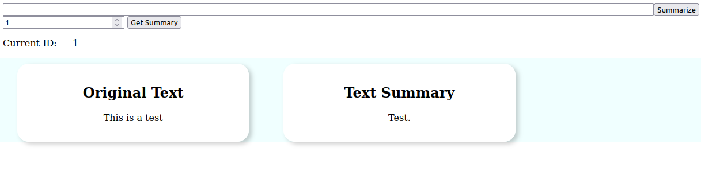

# Simple Text Summarization API

HTTP REST service for text summarization. Build with Flask, MySQL, and Hugging Face Transformers. 

Why?
  - The goal was to have a working application that could be build on top of. 
  - To practice creating a small system that utilizes Flask, MySQL, and Machine learning
  - Learning/Practice

# API

There are two endpoints of interest:
### /api/v1/summarize

This will summarize text and store it. Returns a json object with the following:
```json
{ 
  summary_id=summary_id, 
  summary=text_summary
}
```

`content-type`: `application/x-www-form-urlencoded` 

POST parameters: text, where `text` is the text to be summarized.

### /api/v1/get_summary
Retrieve the text data using `summary_id`. 
Returns a Json object with the following: 
```
{
  long_text=long_text, 
  text_summary=text_summary
}
```
where `long_text` is the original text and `text_summary` is the summarized text. Parameters
`content-type`: `application/json` 
POST parameters: `summary_id`, the `PRIMARY KEY` ID of the summarized text. 

## Running the application

The app runs on Flask, with MySQL as a database to store text summaries. 
Further, the app has been containerized using Docker and docker-compose.


To run:

```shell
sudo docker-compose up
```
and then navigate to `http://0.0.0.0:5000/` in a browser.

This brings up a small webpage that makes use of the summary API. The webpage is intended to just showcase
how the endpoints work, and to test summarizing text. 





### Running without Docker/docker-compose
If you do not have docker-compose installed, or are unfamiliar with it, one could also do the following:
   - using any python environment, install `requirements.txt`
   - initialize a database `summary` using MySQL, and run `./db/init.sql`
   - update local MySQL credentials in `./app/backend/database/connector.py`: 
   - run `python wsgi.py`
   - navigate to `http://0.0.0.0:5000/`


